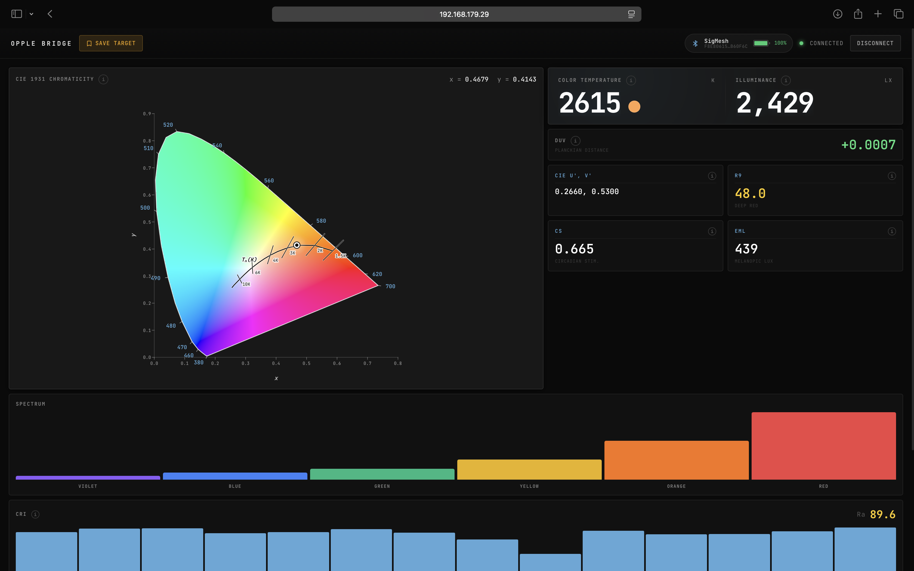

# Opple Bridge

Your sensor has to live where the light lands. You don't.

The Opple Light Master IV (and III) is the photometer a lot of lighting designers already carry. The problem is Bluetooth: the sensor sits at the actor's position, you're at FOH, and standing under a moving light with a phone isn't how anyone wants to work a show. Opple Bridge puts a small computer next to the sensor, speaks BLE to it, and streams everything to a real-time web dashboard over your local WiFi — no internet, no cloud, open from the console laptop, a tablet, your phone, anything on the same network.

It supports both **Light Master III** (G3, 6 channels) and **Light Master IV** (G4, 9 channels) and tells them apart automatically.

## What it does

Live over WebSocket: xy chromaticity, CCT, Duv, Lux, CRI Ra + R1–R14, EML, CS — updated continuously. The CIE 1931 diagram shows you the live point. Flicker (modulation depth, flicker index, dominant frequency, IEEE 1789 risk badge) runs on demand, not as a permanent stream, because you only need it when you need it.

Snapshot a reading as a target and the dashboard shows you live deltas as you tune the rig.




## What's next

The architecture — sensor on one side, network on the other, science in the middle — is pointing toward something specific: close-the-loop color matching against a real measurement. Put the sensor where you want the light. Select the fixture or group on the console (MA3, or whatever exposes a network API). Give the bridge the console IP. The bridge reads what the sensor sees and drives the fixture's color mixing — CMY flags, RGBW channels, CTO wheels — until the measured color converges on the target.

The other direction is the form factor. A **Raspberry Pi Zero 2W** with a **PiSugar 3** battery and a small **e-paper readout** would shrink the bridge to something you can gaffer-tape next to the sensor and forget about — battery-powered and untethered, exactly like the Opple itself. And by standing up its own WiFi hotspot it works in venues with no network at all: phone or tablet connects straight to the bridge, no infrastructure required.

## Running it

```bash
git clone https://github.com/gabrielebaudo/opple-bridge.git
cd opple-bridge
python3 -m venv venv
source venv/bin/activate
pip install -r requirements.txt

# With a real Opple sensor in BLE range:
python run.py

# Without hardware (mock data, for development or demos):
MOCK_MODE=true python run.py
```

Open `http://<bridge-ip>:8080` in any browser on the same network.

## Tech stack

- Python 3.10+, FastAPI, uvicorn
- [`bleak`](https://github.com/hbldh/bleak) for BLE (Nordic UART Service)
- Tailwind CSS + Alpine.js + HTML5 Canvas (CDN, no build step)
- pytest

## License

MIT.
