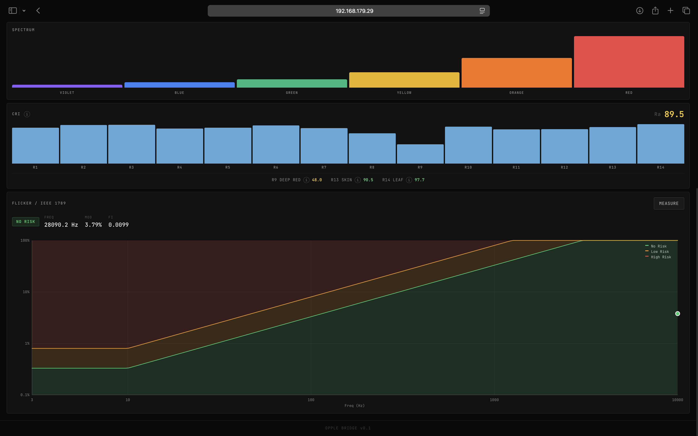
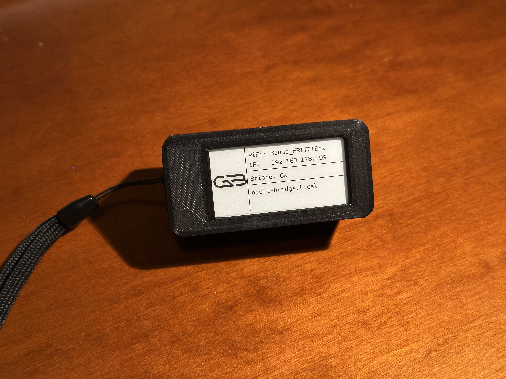
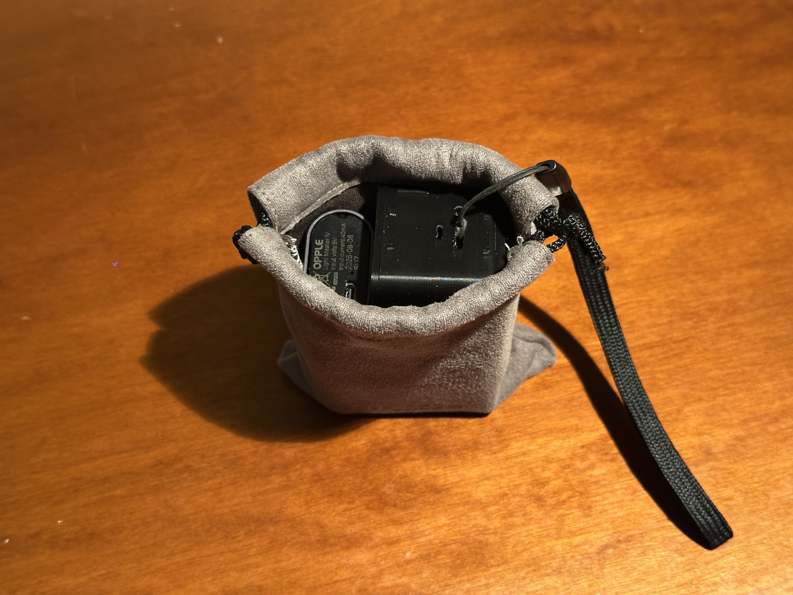

# Opple Bridge

Your sensor has to live where the light lands. You don't.

The Opple Light Master is a photometer a lot of lighting designers already carry. Opple Bridge exposes it over the network through a real-time web UI, so the BLE link stays next to the meter while the operator works from somewhere more useful.

Run it on a general-purpose computer with Python and BLE access, or deploy it on a Raspberry Pi Zero 2 W for a self-contained field unit with hotspot fallback, e-paper status, and battery support.

It supports both **Light Master III** (G3, 6 channels) and **Light Master IV** (G4, 9 channels), with automatic detection.

## What it does

Opple Bridge streams xy chromaticity, CCT, Duv, illuminance, CRI Ra plus R1-R14, EML, and CS over WebSocket. The dashboard plots the live point on a CIE 1931 diagram and keeps target deltas visible while you tune the rig.

Flicker analysis — modulation depth, flicker index, dominant frequency, and IEEE 1789 risk classification — runs on demand instead of as a continuous stream.

You can snapshot any reading as a target and use the live delta view while balancing fixtures.




## Running it

The simplest setup is to run Opple Bridge on a regular computer with Python and BLE access. The Raspberry Pi build below is the compact deployment version.

```bash
git clone https://github.com/gabrielebaudo/opple-bridge.git
cd opple-bridge
python3 -m venv venv
source venv/bin/activate
pip install -r requirements.txt

# With a real Opple sensor in BLE range:
python run.py

# Without hardware (mock data, for development or demos):
MOCK_MODE=true python run.py
```

Open `http://<bridge-ip>` in any browser on the same network.

**BLE device name.** The scanner already recognises the common advertising names used by Light Master III and IV units. If your meter advertises under a different name, append it to `KNOWN_NAMES` in `opple_bridge/ble/scanner.py`:

```python
KNOWN_NAMES = (..., "custom-device-name")
```

## Raspberry Pi deploy

The intended target is a Raspberry Pi Zero 2W running Raspberry Pi OS Bookworm Lite (64-bit).

### Hardware

- Raspberry Pi Zero 2W
- microSD card
- USB power or PiSugar 3 UPS
- Optional: Waveshare 2.13" V4 e-paper display

3D-printable enclosure files are included in [docs/enclosure](/Users/gabrielebaudo/opple-bridge/docs/enclosure).





### Fresh Pi setup

1. Flash **Raspberry Pi OS (Legacy) Lite, 64-bit** with Raspberry Pi Imager. As of May 24, 2026, that is the Bookworm Lite image.
2. In the Imager advanced options:
   - create the user account you actually want to keep on the Pi
   - enable SSH
   - optionally set hostname to `opple-bridge` if you want `opple-bridge.local`
   - optionally pre-load your Wi-Fi credentials only to get into the Pi the first time
3. Make sure that first boot has internet access. Provisioning downloads apt packages, Python dependencies, PiSugar components and the Waveshare driver before it wipes the temporary Wi-Fi profile.
4. Boot the Pi and SSH in as that user.
5. Clone the repo into that user's home directory and run provisioning from that same login:

```bash
git clone https://github.com/gabrielebaudo/opple-bridge.git
cd opple-bridge
sudo bash raspberry/scripts/provision.sh
```

Do **not** run the script from `sudo -i` or a root shell. The provisioning binds systemd, polkit and sudoers permissions to the invoking user, so it must see the real login account through `sudo`.

The provisioning script handles:

- system packages and Python venv
- `NetworkManager` takeover
- `avahi-daemon` for `.local`
- PiSugar server install and model configuration
- Waveshare e-paper library install
- watchdog and journald tuning
- `opple-bridge`, `opple-pi`, Wi-Fi bootstrap and hotspot fallback systemd units

### Important Wi-Fi behavior

Provisioning **intentionally deletes all existing Wi-Fi profiles** from NetworkManager before the final reboot. That includes Wi-Fi credentials injected by Raspberry Pi Imager.

This is deliberate: after provisioning, the Pi should come up in a known state and fall back to its own hotspot when no saved show/home network is configured yet.

So the Raspberry Pi Imager Wi-Fi settings are useful only for the **very first SSH login**. They are not expected to survive the provisioning run.

### First boot after provisioning

At the end of provisioning the Pi reboots automatically. If there are no saved Wi-Fi networks in `/etc/opple-bridge/wifi.yaml`, it starts its fallback hotspot after about 45 seconds:

- SSID: `OPPLE BRIDGE`
- password: open network by default
- address: `http://192.168.1.1`

Connect a phone, tablet or laptop to that hotspot, open the web UI, then go to **Settings** and add the Wi-Fi networks the bridge should know about.

When you save Wi-Fi networks while the Pi is in hotspot mode, reboot once from the Settings panel so NetworkManager re-applies the boot-time profile set. On the next boot it will try those saved networks in priority order, and only fall back to hotspot mode if none connect.

The hotspot name and password are also editable from the Settings panel. Changes take effect the next time hotspot mode activates.

### Existing installs / updates

To update an already provisioned Pi:

```bash
cd ~/opple-bridge
git pull
sudo bash raspberry/scripts/provision.sh
```

The script is intended to be idempotent and safe to re-run after updates.

**Bluetooth** must be powered on and unblocked. If BLE scanning returns no devices:

```bash
sudo rfkill unblock bluetooth
sudo systemctl restart bluetooth
```

To make this permanent across reboots, add the following to `/etc/bluetooth/main.conf`:

```ini
[Policy]
AutoEnable=true
```

**PiSugar 3.** If you are adding a PiSugar 3 UPS, the provisioning script installs and configures the pisugar-server automatically. Two steps must be done manually afterward:

1. **Sync the RTC.** The PiSugar 3's real-time clock ships with a stale timestamp. Open `http://<pi-hostname>.local:8421` in a browser and click the sync button (↻) next to "RTC Time" to copy the current system time into the hardware clock.

2. **Configure the power button.** On the same page, under *Custom Button Function*, set **Long Tap → Safe Shutdown**. This configures the button near the USB-C port for software-triggered shutdown via the OS.

The button near the four green LEDs is the hardware power button. Long press triggers a clean OS shutdown (via `soft_poweroff`). To power the Pi on from a fully powered-off state: short press (shows battery level), then immediately long press.

## Tech stack

- Python 3.10+, FastAPI, uvicorn
- [`bleak`](https://github.com/hbldh/bleak) for BLE (Nordic UART Service)
- Tailwind CSS + Alpine.js + HTML5 Canvas (self-hosted, no build step)
- pytest

## License

MIT.
